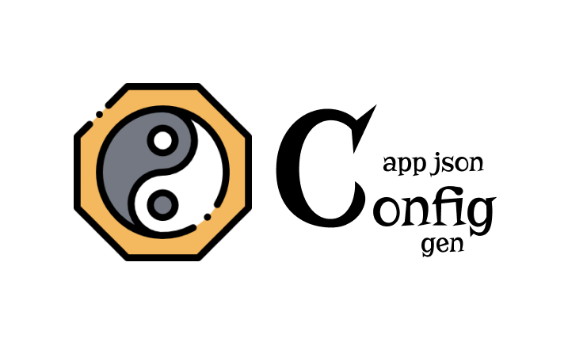

<p align="center">
  
</p>

Usefull tool to create a json configuration file for your js apps.

## Motivation

We can easily use environment variables for app configuration. But when you want more complex configuration structure, probably a `.env` file will not solve your problem. <br/>
Env files needs to prefix every key, like this sample:

```
GOOGLE_MAPS_URL:...
GOOGLE_MAPS_KEY:...
```

Probably you want to use some more structured like:

```json
{
    "GOOGLE_MAPS": {
        "URL": "...",
        "KEY": "..."
    }
}
```

And you can do it. But when you have a multiple environments (`local`, `qa`, `staging`, `production`), it comes to be more complicated.

You probably have one `.env` file for each environemnt and a lot of duplicated keys. For example:

```
// dev.env
GOOGLE_MAPS_KEY:my_google_maps_key
API_URL:http://localhost:3000/api
```

```
// qa.env
GOOGLE_MAPS_KEY:my_google_maps_key
API_URL:http://qa.mysite.com/api
```

Each of the environments have the same google maps api key. It could be easier...

## RESUME IN ACTION

**Shoot first, ask later.**

Open the terminal in root of your project and execute `npm install --save-dev app-json-env-gen`

Create a folder named `__env__` in the root.

Inside the `__env__`, create two files: `global.env.js` and `qa.env.js`.

Now your project must seems like:

```
+ root
|-+ __env__
  |-- global.env.js
  |-- qa.env.js
|-- packages.json
|-- ...other files
```

Inside the `global.env.js`, add:

```js
module.exports = {
    meta: {},
    data: {
        GOOGLE_MAPS: {
            URL: 'https://googlemaps.fake.api',
            KEY: 'th1sisafak3key'
        },
        BACKEND_API: {
            URL: 'https://mysite.com/api'
        }
    }
}
```

Inside the `qa.env.js`, add:

```js
module.exports = {
    meta: {
        from: 'global'
    },
    data: {
        BACKEND_API: {
            URL: 'https://qa.mysite.com/api'
        }
    }
}
```

Open your `package.json` and add this script:

```
"env-qa": "node ./node_modules/app-json-env-gen/cli.js target=qa output=./env.json"
```

In the terminal, run `npm run env-qa`

Your env file will be created in the `env.json` with:

```json
{
    "GOOGLE_MAPS": {
        "URL": "https://googlemaps.fake.api",
        "KEY": "th1sisafak3key"
    },
    "BACKEND_API": {
        "URL": "https://qa.mysite.com/api"
    }
}
```

## How it works

In fact, this lib is not more than a _file merger_ with recursive parent strategy.

### Config files folder

By default, this lib will use the `__env__` folder for the enviroment config files.

If you want to use a custom folder, you can use the `dir` parameter:

```
"env-qa": "node ./node_modules/app-json-env-gen/cli.js dir=./my-envs target=qa output=./env.json"
```

### Config file

When you create a config file, you create the file with this name: `<target>.env.js`.

In our sample, we created two targets: `global` and `qa`, but we can create what we want.

The file have this structure:

```json
{
    "meta": {
        "from": "<other_target>"
    },
    "data": {}
}
```

This file is divided into two sections:

#### meta

This section contains some parameters for the generator.

Today, exist only one attribute named `from`. When this attribute is provided, the generator will copy the values from the source target and these values will be merged with this file.

So, in the example, we have created a `global` and a `qa` file. In the `qa` file, we add the `from: "global"` to the `meta` section.

When we did it, we told to the lib: _get the `data` from the `global.env.js` file. I will override it with my own data._

So, it could be recursive. If we have this three files:

```js
// global.env.js
module.exports = {
    meta: {},
    data: {
        name: 'global',
        version: 1
    }
}
```

```js
// dev.env.js
module.exports = {
    meta: {
        from: 'global'
    },
    data: {
        name: 'dev',
        apiUrl: 'http://dev.site.com/api',
        debug: true
    }
}
```

```js
// local.env.js
module.exports = {
    meta: {
        from: 'dev'
    },
    data: {
        name: 'local',
        apiUrl: 'http://localhost:3000/api'
    }
}
```

And we run the command `node ./node_modules/app-json-env-gen/cli.js target=local output=./env.json`

The result will be the merge of `global > dev > local`:

```json
{
    "name": "local",
    "apiUrl": "http://localhost:3000/api",
    "version": 1,
    "debug": true
}
```

#### data

The `data` section is where you will put all the data that will be added to the resultant `json` file.

### Command line

To execute the generator, we use the cli from node_modules in this format:

```
node ./node_modules/app-json-env-gen/cli.js dir=./my-envs target=qa output=./env.json
```

Where:

-   `node`: invoking the command using nodejs.
-   `./node_modules/app-json-env-gen/cli.js`: the cli lib file that will be executed.
-   `dir=./my-envs`: the directory that contains `.env.js` files, you can change the `./my-envs` for your custom folder. This is optional, default `__env__`.
-   `target=qa`: this is the target file used as a primary file. In this sample, is `qa.env.js`, if you change to `target=potato` it will use the `potato.env.js` as the main file.
-   `output=./env.json`: this is the path that generated file will be created. You can change the `./env.json` to the path you want.

## Thanks to

<div>Icons made by <a href="http://www.freepik.com" title="Freepik">Freepik</a> from <a href="https://www.flaticon.com/" title="Flaticon">www.flaticon.com</a> is licensed by <a href="http://creativecommons.org/licenses/by/3.0/" title="Creative Commons BY 3.0" target="_blank">CC 3.0 BY</a></div>
